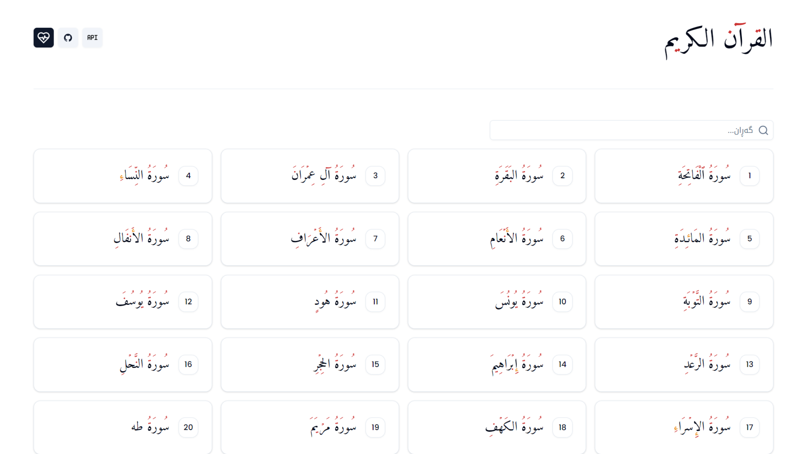

# Quran Application

Welcome to the Quran Application, a beautifully crafted web application built using Next.js and TypeScript. This application allows users to explore and read the Surahs of the Quran in a simple and intuitive interface, now with audio for each Ayah.

## [Preview](https://quran.hoshang.dev)



## Features

- **Browse Surahs**: Users can view a list of all Surahs and select any to read in detail.
- **Read Surahs**: Each Surah can be read in a beautifully formatted text that enhances the reading experience.
- **Listen to Ayahs**: Experience the Quran audibly by listening to the recitation of each Ayah.

## Technology Stack

- **Next.js**: A powerful React framework that enables functionality such as server-side rendering and generating static websites.
- **TypeScript**: A superset of JavaScript that adds static types to the language, enhancing code quality and readability.
- **Shadcn UI**: A modern UI library used to design the beautiful and responsive user interface of this application. Learn more about Shadcn UI at [Shadcn UI](https://ui.shadcn.com/).

## API Usage

This application utilizes the [Al-Quran Cloud API](https://alquran.cloud/api) to fetch the Surahs data and audio files for each Ayah. This API provides a robust and reliable source of Quranic text, information, and audio, making it an excellent choice for our application.

## Getting Started

To run this application locally, you need to have Node.js installed on your machine. Follow these steps:

1. Clone the repository:
   ```bash
   git clone https://github.com/HoshangDEV/NextJS-Quran-App.git
   ```
2. Navigate to the project directory:
   ```bash
   cd quran-app
   ```
3. Install dependencies:
   ```bash
   npm install
   ```
4. Run the development server:
   ```bash
   npm run dev
   ```
   Open [http://localhost:3000](http://localhost:3000) with your browser to see the result.

## Contributing

Contributions are what make the open-source community such an amazing place to learn, inspire, and create. Any contributions you make are **greatly appreciated**.

1. Fork the Project
2. Create your Feature Branch (`git checkout -b feature/AmazingFeature`)
3. Commit your Changes (`git commit -m 'Add some AmazingFeature'`)
4. Push to the Branch (`git push origin feature/AmazingFeature`)
5. Open a Pull Request

## License

Distributed under the MIT License. See `LICENSE` for more information.

## Contact

HoshangDEV - [HoshangDEV](https://hoshang.dev) - hoshangdev@gmail.com

Project Link: [https://github.com/HoshangDEV/NextJS-Quran-App](https://github.com/HoshangDEV/NextJS-Quran-App)

## Acknowledgements

- [Next.js](https://nextjs.org/)
- [TypeScript](https://www.typescriptlang.org/)
- [Shadcn UI](https://ui.shadcn.com/)
- [Al-Quran Cloud API](https://alquran.cloud/api)
